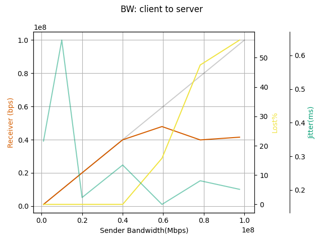
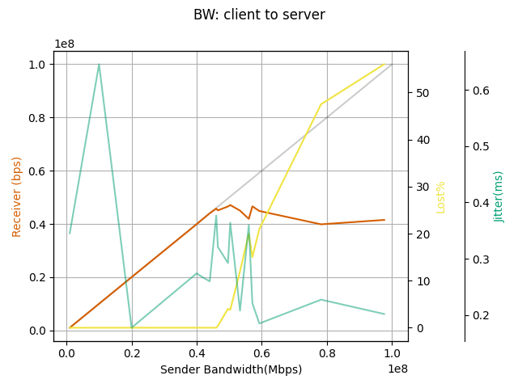

iperf_util
==========

utility to check the network performance.

## How to use

```
% iperf_util.py server --save-dir sample --measure-bw
bandwidth test list: 1000000,10000000,20000000,40000000,60000000,80000000,100000000
iperf3 -u -c server -P 1 -b 1000000 -l 1448
iperf3 -u -c server -P 1 -b 10000000 -l 1448
iperf3 -u -c server -P 1 -b 20000000 -l 1448
iperf3 -u -c server -P 1 -b 40000000 -l 1448
iperf3 -u -c server -P 1 -b 60000000 -l 1448
iperf3 -u -c server -P 1 -b 80000000 -l 1448
iperf3 -u -c server -P 1 -b 100000000 -l 1448
```

Then, you can see the result.

```
% iperf_util.py server --save-dir sample --graph-bw
bandwidth test list: all
Tgt BW    Snd BW   PL Size  Rcv BW lost%  jitter
--------- -------- -------- ------ ------ ------
      1.0      1.0     1448    1.0    0.0  0.251
     10.0     10.0     1448   10.0    0.0  0.695
     20.0     20.0     1448   20.0    0.0  0.198
     40.0     40.0     1448   40.0    0.0  0.277
     60.0     59.2     1448  51.15   9.95  0.139
     80.0     80.0     1448   46.9   39.0  0.136
    100.0     95.9     1448   44.5   53.0  0.223
```



*Tgt BW* is the throughput which is used by the client's iperf command.
*Snd BW* and *Rcv BW* are the sender's and receiver's throughput respectively.
*lost%* is the loss rate.
So, *Rcv BW* corresponding to *lost%* as close as possible to zero is the throughput of this link.

In this example, you can estimate that the throughput is placed between 40Mbps and 60Mbps.
You can check more precisely with the `--bw-list` option like below.

```
% iperf_util.py server --save-dir sample --measure-bw --bw-list range:40m,60m,2m
bandwidth test list: 40000000,42000000,44000000,46000000,48000000,50000000,52000000,54000000,56000000,58000000,60000000
iperf3 -u -c server -P 1 -b 40000000 -l 1448
iperf3 -u -c server -P 1 -b 42000000 -l 1448
iperf3 -u -c server -P 1 -b 44000000 -l 1448
iperf3 -u -c server -P 1 -b 46000000 -l 1448
iperf3 -u -c server -P 1 -b 48000000 -l 1448
iperf3 -u -c server -P 1 -b 50000000 -l 1448
iperf3 -u -c server -P 1 -b 52000000 -l 1448
iperf3 -u -c server -P 1 -b 54000000 -l 1448
iperf3 -u -c server -P 1 -b 56000000 -l 1448
iperf3 -u -c server -P 1 -b 58000000 -l 1448
iperf3 -u -c server -P 1 -b 60000000 -l 1448
```

Then, you can check the result again.

```
% iperf_util.py server --save-dir sample --graph-bw
bandwidth test list: all
Tgt BW   Snd BW   PL Size  Rcv BW lost%  jitter
-------- -------- -------- ------ ------ ------
     1.0      1.0     1448    1.0    0.0  0.251
    10.0     10.0     1448   10.0    0.0  0.695
    20.0     20.0     1448   20.0    0.0  0.198
    40.0     40.0     1448   40.0    0.0  0.255
    42.0     42.0     1448   42.0    0.0  0.267
    44.0     44.0     1448   44.0    0.0   0.26
    46.0     46.0     1448  45.75    0.0  0.377
    48.0     48.0     1448  47.95  0.004   0.35
    50.0    49.47     1448   48.2  1.372  0.319
    52.0    51.75     1448   49.7  0.968  0.265
    54.0    52.95     1448  49.85   2.35  0.183
    56.0     56.0     1448   52.8   0.54  0.158
    58.0     57.5     1448   48.7   11.0  0.387
    60.0    59.47     1448   51.1   10.3  0.125
    80.0     80.0     1448   46.9   39.0  0.136
   100.0     95.9     1448   44.5   53.0  0.223
```



The maximum throughput can be located between 50Mbps and 58Mbps.
The receiver's throughput is not stable because I used the wireless link for this test.

You can also check the number of the packet per seconds.
For this test, please Remember that you have to specify the target throughput.
Let's use 60m which was measured by the above exercise.

```
% iperf_util.py server --save-dir sample --measure-pps --target-bw 60m
Target BW: 60m
packet size test list: 16,32,64,128,256,512,768,1024,1280,1448
iperf3 -u -c server -P 1 -b 10m -l 16
iperf3 -u -c server -P 1 -b 10m -l 32
iperf3 -u -c server -P 1 -b 10m -l 64
iperf3 -u -c server -P 1 -b 10m -l 128
iperf3 -u -c server -P 1 -b 10m -l 256
iperf3 -u -c server -P 1 -b 10m -l 512
iperf3 -u -c server -P 1 -b 10m -l 768
iperf3 -u -c server -P 1 -b 10m -l 1024
iperf3 -u -c server -P 1 -b 10m -l 1280
iperf3 -u -c server -P 1 -b 10m -l 1448
```

You can check the graph of the result as well.

```
% iperf_util.py server --save-dir sample --graph-pps
packet size test list: all
target_bw bw       psize    Mbps   lost%  jitter
--------- -------- -------- ------ ------ ------
     60.0     13.9       16   3.38   74.0 29.933
     60.0     30.0       32   6.73   76.0  0.035
     60.0     57.9       64   15.6   73.0  0.028
     60.0     60.0      128   39.6   34.0  0.031
     60.0     60.0      256   51.4   14.0  0.046
     60.0     59.7      512   57.6    2.5  0.359
     60.0     59.5      768   53.3    8.7  0.124
     60.0     59.3     1024   47.5   18.0  0.135
     60.0     60.0     1280   58.9    1.8  0.228
     60.0     58.3     1448   50.0   12.0  0.273
```

## JSON output of iperf3

This program doesn't use the JSON output of the iperf3 command.
Instead, it just parses the text output without the `-J` option..

The reason is that the JSON output doesn't include the value of bps
at the receiver.  It doesn't include both the payload size and the
target bandwidth which were used during the test.

For example,

The server's output:

```
[ ID] Interval           Transfer     Bitrate         Jitter    Lost/Total Datagrams
[  5]   0.00-10.13  sec  49.5 MBytes  41.0 Mbits/sec  0.871 ms  68236/118888 (57%)  receiver
```

The client's output in JSON:

```
{
    "end":  {
        "sum":  {
                "start":        0,
                "end":  10.128016,
                "seconds":      10.128016,
                "bytes":        124992512,
                "bits_per_second":      99992009.7598048,
                "jitter_ms":    0.871474268426131,
                "lost_packets": 68236,
                "packets":      122079,
                "lost_percent": 55.894953267965825,
                "sender":       true
        }
    }
}
```

The command line at the client side:

```
% iperf3 -c target -u -b 100m -l 1024 -J
```

